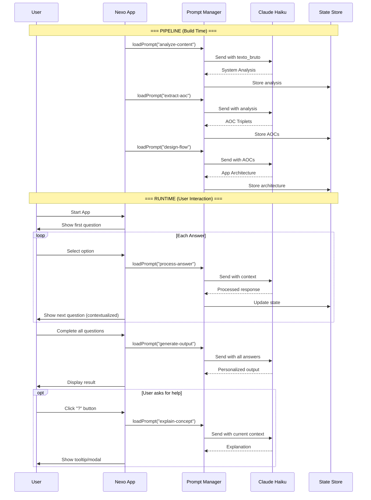

# NEXORAMA AI Architecture

> Arquitetura com IA Generativa Integrada (Claude Haiku 4.5)

**Versão**: 2.0.0
**Autor**: Winston (Architect)
**Data**: 2025-01-03

---

## 1. Visão Geral da Mudança

### Antes (v1.0) - Template-Based
```
Conteúdo → Templates Estáticos → Output Fixo
```

### Depois (v2.0) - AI-Powered
```
Conteúdo → IA Analisa → IA Gera → IA Personaliza → Output Dinâmico
```

### Princípios da Nova Arquitetura

1. **IA como Co-Piloto**: Haiku auxilia em cada fase, não substitui
2. **Prompts Especializados**: Cada fase tem prompts otimizados
3. **Custo-Eficiente**: Haiku é barato (~$0.25/1M tokens input)
4. **Fallback Graceful**: Se IA falhar, template assume
5. **Streaming UX**: Respostas aparecem progressivamente

---

## 2. Diagrama de Arquitetura

```mermaid
flowchart TD
    subgraph INPUT["📥 INPUT LAYER"]
        A[Conteúdo Bruto] --> B{Router}
        B --> C[ETL Agent]
        C --> D[texto_bruto.md]
    end

    subgraph AI_LAYER["🧠 AI PROCESSING LAYER"]
        D --> E[/"🤖 PROMPT: Analyze Content"/]
        E --> F[Claude Haiku]
        F --> G[Content Analysis]

        G --> H[/"🤖 PROMPT: Extract AOC"/]
        H --> I[Claude Haiku]
        I --> J[AOC Triplets]

        J --> K[/"🤖 PROMPT: Design Flow"/]
        K --> L[Claude Haiku]
        L --> M[App Architecture]
    end

    subgraph RUNTIME["⚡ RUNTIME LAYER"]
        M --> N[Nexo App]
        N --> O{User Input}
        O --> P[/"🤖 PROMPT: Process Answer"/]
        P --> Q[Claude Haiku]
        Q --> R[Dynamic Response]
        R --> O
        O --> S[/"🤖 PROMPT: Generate Output"/]
        S --> T[Claude Haiku]
        T --> U[Personalized Result]
    end

    subgraph PROMPTS["📝 PROMPT CATALOG"]
        P1[analyze-content.md]
        P2[extract-aoc.md]
        P3[design-flow.md]
        P4[process-answer.md]
        P5[generate-output.md]
        P6[explain-concept.md]
        P7[suggest-option.md]
    end

    style AI_LAYER fill:#1e1b4b,stroke:#6366f1
    style RUNTIME fill:#164e63,stroke:#06b6d4
    style PROMPTS fill:#365314,stroke:#84cc16
```



---

## 3. Camadas da Arquitetura

### 3.1 Prompt Layer (Nova)

Camada dedicada para gerenciar todos os prompts do sistema.

```
expansion-packs/nexorama/prompts/
├── pipeline/
│   ├── analyze-content.md       # Fase 1: Análise inicial
│   ├── extract-aoc.md           # Fase 2: Extração AOC
│   ├── design-flow.md           # Fase 3: Design do fluxo
│   └── generate-code.md         # Fase 4: Geração de código
│
├── runtime/
│   ├── process-answer.md        # Processa resposta do usuário
│   ├── generate-output.md       # Gera output final
│   ├── explain-concept.md       # Explica conceito ao usuário
│   └── suggest-option.md        # Sugere próxima opção
│
└── utils/
    ├── summarize.md             # Resume textos longos
    ├── validate.md              # Valida estruturas
    └── translate-tone.md        # Ajusta tom de voz
```

### 3.2 AI Service Layer

```typescript
// ai-service.ts
interface AIService {
  model: 'claude-haiku-4-5-20241022';
  maxTokens: number;
  temperature: number;
}

interface PromptRequest {
  promptId: string;           // ID do prompt no catálogo
  variables: Record<string, string>;  // Variáveis para substituir
  context?: string;           // Contexto adicional
  stream?: boolean;           // Streaming response
}

interface PromptResponse {
  content: string;
  tokensUsed: {
    input: number;
    output: number;
  };
  cost: number;               // Custo em USD
}
```

### 3.3 Integration Points

| Ponto | Trigger | Prompt | Propósito |
|-------|---------|--------|-----------|
| Post-Extraction | Texto extraído | `analyze-content` | Identificar sistema latente |
| AOC Generation | Análise pronta | `extract-aoc` | Gerar triplets automaticamente |
| Flow Design | AOCs prontos | `design-flow` | Criar arquitetura do app |
| User Answer | Cada resposta | `process-answer` | Contextualizar próxima pergunta |
| Help Request | Usuário pede ajuda | `explain-concept` | Explicar opção/conceito |
| Final Output | Todas respostas | `generate-output` | Criar resultado personalizado |

---

## 4. Catálogo de Prompts

### 4.1 PROMPT: analyze-content

**Fase**: Pipeline - Pós-Extração
**Tokens estimados**: ~2000 input, ~500 output
**Custo**: ~$0.0006

```markdown
# System
Você é um especialista em análise de conteúdo educacional.
Sua tarefa é identificar o SISTEMA LATENTE escondido no conteúdo.

# Instructions
Analise o texto e extraia:
1. **Nome do Sistema**: Como chamar esta metodologia (max 5 palavras)
2. **Propósito**: O que resolve em 1 frase
3. **Transformação**: De [estado inicial] para [estado final]
4. **Público**: Quem se beneficia
5. **Estrutura**: Fases/etapas identificadas
6. **Conceitos-chave**: 5-10 termos importantes

# Format
Responda em YAML estruturado.

# Content
{{TEXTO_BRUTO}}
```

---

### 4.2 PROMPT: extract-aoc

**Fase**: Pipeline - Decomposição
**Tokens estimados**: ~3000 input, ~1500 output
**Custo**: ~$0.0012

```markdown
# System
Você é especialista no framework AOC (Ação-Objeto-Condição).
Decomponha o conteúdo em triplets atômicos.

# AOC Framework
- **A**ção: Verbo imperativo (Analise, Defina, Liste)
- **O**bjeto: Substantivo alvo (metas, obstáculos, recursos)
- **C**ondição: Contexto/filtro (se X, quando Y) - pode ser null

# Instructions
1. Leia a análise do sistema latente
2. Identifique TODAS as instruções acionáveis
3. Decomponha cada uma em AOC
4. Categorize: diagnostico | coleta | processamento | output
5. Ordene por dependência lógica
6. Mínimo 8, máximo 20 triplets

# Format
```yaml
aoc_triplets:
  - id: AOC001
    acao: ""
    objeto: ""
    condicao: ""
    categoria: ""
    fonte: ""
```

# Analysis
{{SYSTEM_ANALYSIS}}

# Original Content
{{TEXTO_BRUTO}}
```

---

### 4.3 PROMPT: design-flow

**Fase**: Pipeline - Arquitetura
**Tokens estimados**: ~2500 input, ~2000 output
**Custo**: ~$0.0014

```markdown
# System
Você é um UX Designer especializado em wizards interativos.
Projete o fluxo de um Nexo App baseado nos AOC triplets.

# Constraints
- Máximo 7 telas (exceto start e output)
- 2-4 opções por pergunta
- Todos os caminhos devem convergir para output
- Perguntas devem ser claras e acionáveis

# Captação Systems (escolha o mais adequado)
1. **Afunilante**: Múltiplas dimensões → diagnóstico único
2. **Socrático**: Perguntas guiam descoberta
3. **Temporal**: Fases cronológicas
4. **Espelho**: Comparação atual vs desejado

# Instructions
1. Agrupe AOCs relacionados em telas
2. Defina pergunta principal de cada tela
3. Crie opções baseadas nos AOCs
4. Mapeie navegação entre telas
5. Defina template de output

# Format
Responda com YAML completo de nexo_architecture.

# AOC Triplets
{{AOC_TRIPLETS}}

# System Analysis
{{SYSTEM_ANALYSIS}}
```

---

### 4.4 PROMPT: process-answer

**Fase**: Runtime - Cada resposta
**Tokens estimados**: ~800 input, ~200 output
**Custo**: ~$0.0003

```markdown
# System
Você é um assistente de navegação em sistema interativo.
Processe a resposta do usuário e prepare o contexto para a próxima tela.

# Current State
- Tela atual: {{CURRENT_SCREEN}}
- Resposta: {{USER_ANSWER}}
- Histórico: {{ANSWER_HISTORY}}

# Instructions
1. Valide se a resposta faz sentido
2. Extraia insight da escolha
3. Prepare contexto para próxima pergunta
4. Sugira personalização se aplicável

# Format
```json
{
  "valid": true,
  "insight": "...",
  "nextContext": "...",
  "personalization": "..."
}
```
```

---

### 4.5 PROMPT: generate-output

**Fase**: Runtime - Output Final
**Tokens estimados**: ~1500 input, ~1000 output
**Custo**: ~$0.0008

```markdown
# System
Você é um especialista em criar documentos personalizados.
Gere o output final baseado nas respostas do usuário.

# User Profile
- Nome: {{USER_NAME}}
- Respostas: {{ALL_ANSWERS}}

# System Context
- Sistema: {{SISTEMA_LATENTE}}
- Tipo de output: {{OUTPUT_TYPE}}

# Instructions
1. Analise o padrão das respostas
2. Identifique perfil/categoria do usuário
3. Gere diagnóstico personalizado
4. Crie recomendações específicas
5. Sugira próximos passos acionáveis

# Tone
- Direto e acionável
- Personalizado (use o nome)
- Motivacional sem ser piegas
- Específico (evite generalidades)

# Format
Responda em HTML formatado para exibição direta.
Use classes Tailwind para styling.
```

---

### 4.6 PROMPT: explain-concept

**Fase**: Runtime - Help/Dúvida
**Tokens estimados**: ~500 input, ~300 output
**Custo**: ~$0.0002

```markdown
# System
Você é um mentor paciente que explica conceitos complexos de forma simples.

# Context
- Sistema: {{SISTEMA_LATENTE}}
- Tela atual: {{CURRENT_SCREEN}}
- Conceito: {{CONCEPT_TO_EXPLAIN}}

# Instructions
1. Explique o conceito em 2-3 frases simples
2. Dê um exemplo prático
3. Conecte com a pergunta atual
4. Mantenha tom acolhedor

# Format
Responda em texto simples, max 150 palavras.
```

---

### 4.7 PROMPT: suggest-option

**Fase**: Runtime - Sugestão
**Tokens estimados**: ~600 input, ~150 output
**Custo**: ~$0.0002

```markdown
# System
Você é um coach que ajuda pessoas a tomar decisões.

# Context
- Pergunta: {{CURRENT_QUESTION}}
- Opções: {{OPTIONS}}
- Histórico: {{ANSWER_HISTORY}}
- Perfil emergente: {{USER_PROFILE}}

# Instructions
Com base no padrão de respostas anteriores, sugira qual opção
provavelmente faz mais sentido para este usuário.
Explique brevemente o porquê.

# Format
```json
{
  "suggestedOption": "option_id",
  "reason": "..."
}
```
```

---

## 5. Fluxo de Dados com IA



---

## 6. Estimativa de Custos

### Preços Claude Haiku 4.5 (2025)
- **Input**: $0.25 / 1M tokens
- **Output**: $1.25 / 1M tokens

### Por Execução do Pipeline

| Prompt | Input Tokens | Output Tokens | Custo |
|--------|--------------|---------------|-------|
| analyze-content | 2,000 | 500 | $0.0011 |
| extract-aoc | 3,000 | 1,500 | $0.0026 |
| design-flow | 2,500 | 2,000 | $0.0031 |
| **Total Pipeline** | **7,500** | **4,000** | **$0.0069** |

### Por Sessão de Usuário (Runtime)

| Prompt | Calls | Input | Output | Custo |
|--------|-------|-------|--------|-------|
| process-answer | 5x | 4,000 | 1,000 | $0.0023 |
| explain-concept | 2x | 1,000 | 600 | $0.0010 |
| generate-output | 1x | 1,500 | 1,000 | $0.0016 |
| **Total Runtime** | **8x** | **6,500** | **2,600** | **$0.0049** |

### Custo Total por Nexo App Completo

| Fase | Custo |
|------|-------|
| Pipeline (uma vez) | $0.0069 |
| Runtime (por usuário) | $0.0049 |
| **Total por usuário** | **~$0.01** |

### Projeção Mensal

| Cenário | Usuários/mês | Custo/mês |
|---------|--------------|-----------|
| MVP | 100 | $1.00 |
| Growth | 1,000 | $10.00 |
| Scale | 10,000 | $100.00 |

---

## 7. Implementação Técnica

### 7.1 Prompt Manager

```typescript
// prompt-manager.ts

interface PromptConfig {
  id: string;
  path: string;
  model: string;
  maxTokens: number;
  temperature: number;
  cache?: boolean;
}

class PromptManager {
  private prompts: Map<string, PromptConfig>;
  private cache: Map<string, string>;

  async loadPrompt(id: string): Promise<string> {
    const config = this.prompts.get(id);
    const template = await this.readTemplate(config.path);
    return template;
  }

  async execute(
    promptId: string,
    variables: Record<string, string>,
    options?: { stream?: boolean }
  ): Promise<PromptResponse> {
    const template = await this.loadPrompt(promptId);
    const prompt = this.interpolate(template, variables);

    const response = await this.callClaude({
      model: 'claude-haiku-4-5-20241022',
      messages: [{ role: 'user', content: prompt }],
      max_tokens: this.prompts.get(promptId).maxTokens,
      stream: options?.stream
    });

    return {
      content: response.content,
      tokensUsed: response.usage,
      cost: this.calculateCost(response.usage)
    };
  }
}
```

### 7.2 Runtime Integration

```typescript
// nexo-app-runtime.ts

class NexoAppRuntime {
  private promptManager: PromptManager;
  private state: AppState;

  async processUserAnswer(
    screenId: string,
    answer: string
  ): Promise<ProcessedAnswer> {
    // Chamar IA para processar
    const response = await this.promptManager.execute(
      'process-answer',
      {
        CURRENT_SCREEN: screenId,
        USER_ANSWER: answer,
        ANSWER_HISTORY: JSON.stringify(this.state.answers)
      }
    );

    // Atualizar estado
    this.state.addAnswer(screenId, answer, response.content);

    return JSON.parse(response.content);
  }

  async generateFinalOutput(): Promise<string> {
    const response = await this.promptManager.execute(
      'generate-output',
      {
        USER_NAME: this.state.userName,
        ALL_ANSWERS: JSON.stringify(this.state.answers),
        SISTEMA_LATENTE: this.state.sistemaLatente,
        OUTPUT_TYPE: this.state.outputType
      },
      { stream: true }
    );

    return response.content;
  }
}
```

### 7.3 API Integration

```typescript
// claude-api.ts

import Anthropic from '@anthropic-ai/sdk';

const client = new Anthropic({
  apiKey: process.env.ANTHROPIC_API_KEY
});

async function callHaiku(
  prompt: string,
  options: {
    maxTokens?: number;
    temperature?: number;
    stream?: boolean;
  } = {}
): Promise<ClaudeResponse> {
  const response = await client.messages.create({
    model: 'claude-haiku-4-5-20241022',
    max_tokens: options.maxTokens || 1024,
    messages: [{ role: 'user', content: prompt }],
    stream: options.stream
  });

  return response;
}
```

---

## 8. Nova Estrutura de Arquivos

```
expansion-packs/nexorama/
├── config.yaml
├── README.md
│
├── agents/
│   ├── nexorama-orchestrator.md
│   ├── aoc-decomposer.md
│   └── nexo-builder.md
│
├── prompts/                      # 🆕 NOVO
│   ├── catalog.yaml              # Registro de todos os prompts
│   ├── pipeline/
│   │   ├── analyze-content.md
│   │   ├── extract-aoc.md
│   │   ├── design-flow.md
│   │   └── generate-code.md
│   ├── runtime/
│   │   ├── process-answer.md
│   │   ├── generate-output.md
│   │   ├── explain-concept.md
│   │   └── suggest-option.md
│   └── utils/
│       ├── summarize.md
│       └── validate.md
│
├── lib/                          # 🆕 NOVO
│   ├── prompt-manager.ts
│   ├── claude-api.ts
│   ├── nexo-runtime.ts
│   └── cost-tracker.ts
│
├── templates/
│   ├── nexo-app-ai-starter.html  # 🆕 Template com IA
│   └── ...
│
└── workflows/
    └── nexorama-ai-pipeline.yaml # 🆕 Pipeline com IA
```

---

## 9. Comparativo: Antes vs Depois

| Aspecto | v1.0 (Template) | v2.0 (AI-Powered) |
|---------|-----------------|-------------------|
| AOC Extraction | Manual/Semi-auto | 100% automático |
| Flow Design | Template fixo | Gerado por IA |
| User Experience | Estática | Adaptativa |
| Output | Template interpolado | Personalizado por IA |
| Help System | FAQ estático | IA explica em contexto |
| Custo por usuário | $0 | ~$0.01 |
| Qualidade output | Média | Alta |
| Tempo de build | Horas | Minutos |

---

## 10. Próximos Passos

1. **Criar diretório de prompts** com todos os 7+ prompts
2. **Implementar PromptManager** em TypeScript
3. **Atualizar template HTML** para chamar IA via API
4. **Criar endpoint/backend** para proxy das chamadas
5. **Testar com Case** Tay Dantas
6. **Medir custos reais** vs estimados
7. **Otimizar prompts** baseado em resultados

---

*Arquitetura v2.0 - AI-Powered NEXORAMA*
*Designed by Winston 🏗️*
