# NEXORAMA Workflow Architecture

> Arquitetura de Agentes para Transformação de Conteúdo em Sistemas de IA

---

## 1. Visão Geral do Sistema

### Objetivo
Transformar conteúdo bruto (livros, vídeos, textos) em Nexo Apps interativos através de um pipeline orquestrado de agentes especializados.

### Princípios Arquiteturais
- **Routing Inteligente**: Detecção automática do tipo de conteúdo
- **Especialização**: Cada agente domina uma fase específica
- **Handoffs Claros**: Prompts estruturados entre fases
- **Checkpoints**: Validação antes de avançar
- **Outputs Versionados**: Artefatos rastreáveis em cada fase

---

## 2. Diagrama de Fluxo Principal

```mermaid
flowchart TD
    subgraph INPUT["📥 INPUT LAYER"]
        A[Conteúdo Bruto] --> B{Detector de Tipo}
        B -->|PDF/Livro| C1[📄 document-specialist]
        B -->|YouTube| C2[🎬 youtube-specialist]
        B -->|Reels/Instagram| C3[🌐 web-specialist]
        B -->|Texto Direto| C4[📝 Skip Extraction]
    end

    subgraph ETL["🔄 ETL LAYER"]
        C1 --> D[texto_bruto.md]
        C2 --> D
        C3 --> D
        C4 --> D
    end

    subgraph ANALYSIS["🧠 ANALYSIS LAYER"]
        D --> E[cognitive-analyst]
        E --> F[aoc_decomposition.yaml]
        F --> G{Validação AOC}
        G -->|Falha| E
        G -->|OK| H[system-prompt-architect]
    end

    subgraph ARCHITECTURE["🏗️ ARCHITECTURE LAYER"]
        H --> I[nexo_architecture.yaml]
        I --> J{Review Arquitetura}
        J -->|Ajustes| H
        J -->|Aprovado| K[dev]
    end

    subgraph BUILD["⚡ BUILD LAYER"]
        K --> L[Geração de Código]
        L --> M[nexo_app/]
        M --> N{QA Gate}
        N -->|Bugs| K
        N -->|OK| O[✅ Deploy Ready]
    end

    style INPUT fill:#1a1a2e,stroke:#4a4a6a
    style ETL fill:#16213e,stroke:#4a4a6a
    style ANALYSIS fill:#0f3460,stroke:#4a4a6a
    style ARCHITECTURE fill:#1a1a2e,stroke:#4a4a6a
    style BUILD fill:#16213e,stroke:#4a4a6a
```



---

## 3. Agentes por Fase

### Fase 0: Routing (Orquestrador)

| Agente | Responsabilidade |
|--------|------------------|
| `@nexorama-orchestrator` | Detecta tipo de input e roteia para agente ETL apropriado |

**Lógica de Routing:**
```yaml
routing_rules:
  - pattern: "*.pdf|*.epub|*.docx"
    agent: document-specialist

  - pattern: "youtube.com|youtu.be"
    agent: youtube-specialist

  - pattern: "instagram.com/reel|instagram.com/p"
    agent: web-specialist

  - pattern: "text/*|*.md|*.txt"
    agent: bypass
    action: direct_to_analysis
```

### Fase 1: Extração (ETL Layer)

| Tipo de Input | Agente | Ferramentas | Output |
|---------------|--------|-------------|--------|
| PDF/Livro | `@document-specialist` | PyMuPDF, OCR, Unstructured | `texto_bruto.md` |
| YouTube | `@youtube-specialist` | yt-dlp, Whisper, youtube_transcript_api | `texto_bruto.md` |
| Reels/Instagram | `@web-specialist` | Playwright, Instaloader | `texto_bruto.md` |
| Texto Direto | - | - | `texto_bruto.md` (passthrough) |

### Fase 2: Decomposição AOC (Analysis Layer)

| Agente | Responsabilidade |
|--------|------------------|
| `@cognitive-analyst` | Aplica framework AOC para extrair sistema latente |

**Framework AOC:**
- **A**ção: O que o usuário deve FAZER
- **O**bjeto: SOBRE o que age
- **C**ondição: QUANDO/SE aplica

### Fase 3: Arquitetura (Architecture Layer)

| Agente | Responsabilidade |
|--------|------------------|
| `@system-prompt-architect` | Projeta grafo de decisão e estrutura do Nexo App |

### Fase 4: Construção (Build Layer)

| Agente | Responsabilidade |
|--------|------------------|
| `@dev` | Gera código do Nexo App |
| `@qa` | Valida funcionamento e UX |

---

## 4. Handoff Prompts

### Handoff 1: Orquestrador → ETL Agent

```markdown
# HANDOFF: Content Extraction

## Source
- **Type**: {{content_type}}
- **Location**: {{content_url_or_path}}
- **Size**: {{estimated_size}}

## Instructions
Extract ALL textual content from this source.

## Expected Output
Create `texto_bruto.md` with:
1. Full transcription/extraction
2. Preserve structure (headings, lists, emphasis)
3. Include timestamps if video
4. Add source metadata header

## Quality Criteria
- [ ] No truncation
- [ ] UTF-8 encoding
- [ ] Markdown formatted
- [ ] Source attribution
```

### Handoff 2: ETL Agent → Cognitive Analyst

```markdown
# HANDOFF: AOC Decomposition

## Input
- **File**: texto_bruto.md
- **Content Type**: {{original_type}}
- **Word Count**: {{word_count}}

## Instructions
Apply NEXORAMA AOC Decomposition:

1. **INGESTÃO**: Read entire content, identify SISTEMA LATENTE
2. **DECOMPOSIÇÃO**: Extract AOC triplets
   - Ação: Verbo no imperativo (Faça, Analise, Crie)
   - Objeto: Substantivo alvo (relatório, lista, plano)
   - Condição: Contexto/Filtro (se X, quando Y, para Z)

## Expected Output
Create `aoc_decomposition.yaml`:
```yaml
sistema_latente:
  nome: "Nome do sistema identificado"
  proposito: "O que resolve"

aoc_triplets:
  - id: AOC001
    acao: "Verbo imperativo"
    objeto: "Substantivo"
    condicao: "Contexto"
    fonte: "Linha/timestamp original"

fluxo_principal:
  - step: 1
    aocs: [AOC001, AOC002]
    decisao: "Pergunta para usuário"
```

## Quality Criteria
- [ ] Mínimo 10 AOC triplets
- [ ] Fluxo lógico identificado
- [ ] Sistema latente nomeado
```

### Handoff 3: Cognitive Analyst → System Prompt Architect

```markdown
# HANDOFF: Nexo App Architecture

## Input
- **AOC File**: aoc_decomposition.yaml
- **Sistema**: {{sistema_latente.nome}}

## Instructions
Design the Nexo App architecture:

1. **Grafo de Decisão**: Mapeie fluxo de perguntas
2. **Telas**: 1 tela = 1 decisão do usuário
3. **Outputs**: O que o sistema entrega no final
4. **Personalização**: Como adapta ao contexto do usuário

## Expected Output
Create `nexo_architecture.yaml`:
```yaml
app:
  nome: "Nome do Nexo App"
  tagline: "Frase de impacto"
  sistema_captacao: "afunilante|socratico|temporal|espelho"

grafo:
  inicio:
    pergunta: "Primeira pergunta"
    opcoes:
      - label: "Opção A"
        next: node_2a
      - label: "Opção B"
        next: node_2b

  node_2a:
    pergunta: "Segunda pergunta ramo A"
    ...

output:
  tipo: "relatorio|plano|diagnostico|protocolo"
  template: |
    # {{titulo}}
    ...

ui:
  tema: "dark|light|auto"
  cores:
    primaria: "#hex"
    secundaria: "#hex"
```

## Quality Criteria
- [ ] Máximo 7 telas
- [ ] Cada tela tem 2-4 opções
- [ ] Output final definido
- [ ] Sistema de captação identificado
```

### Handoff 4: System Prompt Architect → Dev

```markdown
# HANDOFF: Nexo App Development

## Input
- **Architecture**: nexo_architecture.yaml
- **AOC Source**: aoc_decomposition.yaml

## Instructions
Build the Nexo App:

1. **Stack**: HTML + Alpine.js + Tailwind CSS
2. **Single File**: index.html com tudo inline
3. **State Management**: Alpine.js x-data
4. **Responsivo**: Mobile-first

## Expected Output
Create `nexo_app/`:
```
nexo_app/
├── index.html      # App completo
├── README.md       # Instruções de uso
└── config.json     # Configurações exportáveis
```

## Code Requirements
- [ ] Zero dependências externas (CDN only)
- [ ] Dark/Light mode toggle
- [ ] Progress indicator
- [ ] Output exportável (copy/download)
- [ ] Animações suaves (CSS transitions)

## Quality Criteria
- [ ] Funciona offline após primeiro load
- [ ] < 100KB total
- [ ] Acessível (ARIA labels)
- [ ] Mobile responsive
```

---

## 5. Validações e Checkpoints

### Checkpoint 1: Post-Extraction

```yaml
checkpoint: post_extraction
validations:
  - name: content_not_empty
    check: "texto_bruto.md exists && size > 100 bytes"

  - name: encoding_valid
    check: "file is valid UTF-8"

  - name: metadata_present
    check: "contains source attribution header"

on_failure:
  action: retry_extraction
  max_retries: 3
```

### Checkpoint 2: Post-AOC

```yaml
checkpoint: post_aoc
validations:
  - name: min_triplets
    check: "aoc_triplets.length >= 5"

  - name: sistema_latente_defined
    check: "sistema_latente.nome is not empty"

  - name: fluxo_exists
    check: "fluxo_principal.length >= 3"

on_failure:
  action: request_human_review
  fallback: retry_with_enhanced_prompt
```

### Checkpoint 3: Post-Architecture

```yaml
checkpoint: post_architecture
validations:
  - name: max_depth
    check: "grafo.max_depth <= 7"

  - name: all_paths_terminate
    check: "every path reaches output node"

  - name: options_balanced
    check: "each node has 2-4 options"

on_failure:
  action: architect_revision
  feedback: "Simplify flow, reduce depth"
```

### Checkpoint 4: Post-Build (QA Gate)

```yaml
checkpoint: qa_gate
validations:
  - name: renders_correctly
    check: "index.html loads without errors"

  - name: all_paths_work
    check: "every option leads to valid next state"

  - name: output_generates
    check: "final output is generated correctly"

  - name: responsive
    check: "works on mobile viewport"

on_failure:
  action: dev_fix
  priority: high
```

---

## 6. Estrutura de Outputs

```
outputs/nexorama/
├── {{project_slug}}/
│   ├── 01_extraction/
│   │   ├── texto_bruto.md           # Texto extraído
│   │   └── extraction_log.json      # Metadados da extração
│   │
│   ├── 02_analysis/
│   │   ├── aoc_decomposition.yaml   # Decomposição AOC
│   │   └── sistema_latente.md       # Descrição do sistema
│   │
│   ├── 03_architecture/
│   │   ├── nexo_architecture.yaml   # Arquitetura do app
│   │   ├── grafo.mermaid            # Diagrama do fluxo
│   │   └── ui_mockups/              # Wireframes (opcional)
│   │
│   ├── 04_build/
│   │   ├── nexo_app/
│   │   │   ├── index.html           # App final
│   │   │   ├── config.json          # Configurações
│   │   │   └── README.md            # Documentação
│   │   └── build_log.json           # Log de geração
│   │
│   └── manifest.yaml                # Metadados do projeto
```

### Manifest Template

```yaml
# manifest.yaml
project:
  name: "{{nome_do_projeto}}"
  slug: "{{slug}}"
  created: "{{timestamp}}"
  source_type: "{{pdf|youtube|reels|text}}"
  source_url: "{{url_ou_path}}"

pipeline:
  extraction:
    agent: "{{agent_used}}"
    duration: "{{seconds}}"
    status: "completed"

  analysis:
    agent: "cognitive-analyst"
    aoc_count: {{number}}
    status: "completed"

  architecture:
    agent: "system-prompt-architect"
    screens: {{number}}
    sistema_captacao: "{{tipo}}"
    status: "completed"

  build:
    agent: "dev"
    file_size: "{{kb}}"
    status: "completed"

quality:
  qa_passed: true
  qa_agent: "qa"
  issues_found: 0

deploy:
  ready: true
  url: null  # Preenchido após deploy
```

---

## 7. Workflow YAML Definition

```yaml
# .aios-core/workflows/nexorama-pipeline.yaml

name: nexorama-pipeline
version: "1.0.0"
description: "Transforma conteúdo bruto em Nexo App via NEXORAMA"

trigger:
  command: "*nexorama"

inputs:
  - name: content_source
    type: string
    required: true
    description: "URL ou path do conteúdo"

  - name: project_name
    type: string
    required: true
    description: "Nome do projeto/sistema"

variables:
  output_dir: "outputs/nexorama/{{project_slug}}"

steps:
  - id: detect_type
    name: "Detectar Tipo de Conteúdo"
    action: classify
    input: "{{content_source}}"
    output: content_type
    rules:
      - pattern: "*.pdf|*.epub|*.docx"
        value: "document"
      - pattern: "youtube.com|youtu.be"
        value: "youtube"
      - pattern: "instagram.com"
        value: "instagram"
      - default: "text"

  - id: extraction
    name: "Extrair Conteúdo"
    agent: "{{content_type}}-specialist"
    skip_if: "content_type == 'text'"
    input:
      source: "{{content_source}}"
    output:
      file: "{{output_dir}}/01_extraction/texto_bruto.md"
    checkpoint: post_extraction

  - id: aoc_decomposition
    name: "Decomposição AOC"
    agent: "cognitive-analyst"
    input:
      file: "{{output_dir}}/01_extraction/texto_bruto.md"
    output:
      file: "{{output_dir}}/02_analysis/aoc_decomposition.yaml"
    checkpoint: post_aoc

  - id: architecture
    name: "Arquitetura do Nexo App"
    agent: "system-prompt-architect"
    input:
      aoc_file: "{{output_dir}}/02_analysis/aoc_decomposition.yaml"
      project_name: "{{project_name}}"
    output:
      file: "{{output_dir}}/03_architecture/nexo_architecture.yaml"
    checkpoint: post_architecture

  - id: build
    name: "Construir Nexo App"
    agent: "dev"
    input:
      architecture: "{{output_dir}}/03_architecture/nexo_architecture.yaml"
    output:
      dir: "{{output_dir}}/04_build/nexo_app/"

  - id: qa_gate
    name: "Validação QA"
    agent: "qa"
    input:
      app_dir: "{{output_dir}}/04_build/nexo_app/"
    checkpoint: qa_gate
    on_failure:
      goto: build
      max_retries: 2

  - id: finalize
    name: "Finalizar"
    action: generate_manifest
    output:
      file: "{{output_dir}}/manifest.yaml"

on_complete:
  message: |
    ✅ Nexo App criado com sucesso!

    📁 Output: {{output_dir}}/04_build/nexo_app/
    📊 Telas: {{architecture.screens}}
    🎯 Sistema: {{aoc_decomposition.sistema_latente.nome}}

    Para testar: abra index.html no navegador
```

---

## 8. Considerações de Implementação

### Dependências entre Agentes

```mermaid
graph LR
    O[orchestrator] --> D[document-specialist]
    O --> Y[youtube-specialist]
    O --> W[web-specialist]

    D --> C[cognitive-analyst]
    Y --> C
    W --> C

    C --> S[system-prompt-architect]
    S --> DEV[dev]
    DEV --> QA[qa]

    style O fill:#e94560
    style C fill:#0f3460
    style S fill:#16213e
    style DEV fill:#1a1a2e
    style QA fill:#533483
```



### Tratamento de Erros

| Fase | Erro Comum | Mitigação |
|------|------------|-----------|
| Extração | Conteúdo protegido | Solicitar arquivo manual |
| Extração | Timeout em vídeo longo | Chunk processing |
| AOC | Conteúdo sem sistema claro | Prompt enhanced + human review |
| Arquitetura | Grafo muito complexo | Forçar simplificação |
| Build | Código com bugs | Loop dev-qa até passar |

### Performance Targets

| Fase | Target | Max |
|------|--------|-----|
| Extração (texto curto) | 30s | 2min |
| Extração (vídeo 30min) | 5min | 15min |
| Decomposição AOC | 2min | 5min |
| Arquitetura | 3min | 10min |
| Build | 5min | 15min |
| **Total (texto curto)** | **10min** | **30min** |
| **Total (vídeo longo)** | **15min** | **45min** |

---

## 9. Próximos Passos

1. **Criar Agente Orquestrador**: `@nexorama-orchestrator`
2. **Adaptar ETL Agents**: Configurar outputs padronizados
3. **Criar Task AOC**: Prompt especializado para decomposição
4. **Template Nexo App**: Starter kit para @dev
5. **Checklist QA**: Critérios específicos para Nexo Apps

---

*Arquitetura desenhada por Winston 🏗️*
*AIOS-FULLSTACK v2.0*
